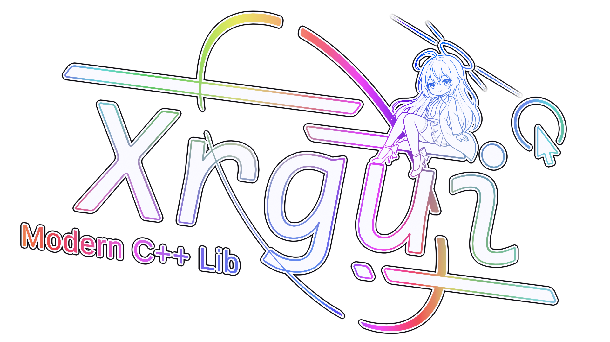

<p align="center">
  
</p>

<h1 align="center">XRGUI</h1>

<p align="center">
  <strong>面向高性能桌面渲染应用的 C++23 保留式 GUI 库</strong>
</p>

<p align="center">
  <a href="properties/showcase/quick_start.md">快速上手</a>
  ·
  <a href="properties/showcase/runtime_showcase.md">运行展示</a>
  ·
  <a href="properties/showcase/user_guide.md">使用指南</a>
  ·
  <a href="properties/showcase/gui_library_comparison_and_roadmap.md">对比与路线图</a>
</p>

<p align="center">
  
  
  
  
</p>

<p align="center">
  
</p>

XRGUI（mo_yanXi's Retained-mode GUI）是一个实验性的 C++23 模块化保留式 GUI 库。它不试图成为 Qt、wxWidgets 或 GTK 的通用替代品，而是面向高性能桌面程序、渲染引擎、可视化工具和复杂内部工具：把保留式元素树、自动布局、C++ 类型化样式、异步任务和 Vulkan 绘制组织成可嵌入宿主渲染管线的 UI 组件。

当前实际推荐路径是 **Windows + 最新 MSVC + Vulkan**；默认接入层提供 GLFW + Vulkan 独立应用封装。

## 为什么关注 XRGUI

<table>
  <tr>
    <td width="50%">
      <strong>复杂 UI 更结构化</strong><br>
      保留式元素树适合长期存在、层级复杂、需要自动布局和异步更新的工具界面，比每帧重建全部关系的 immediate-mode 写法更容易维护。
    </td>
    <td width="50%">
      <strong>贴近渲染管线</strong><br>
      默认后端直接服务 Vulkan Image、抽象绘制指令、Compute Shader 解析、后处理和合成器，更适合嵌入自有 renderer。
    </td>
  </tr>
  <tr>
    <td width="50%">
      <strong>C++ 类型化布局与样式</strong><br>
      样式树、Palette、布局策略和 Cell 元数据都在 C++ 内表达，减少外部样式表解析、字符串选择器和运行时协议成本。
    </td>
    <td width="50%">
      <strong>线程与异步优先</strong><br>
      GUI 可独立线程运行；输入、native 通信、元素异步任务、Action 队列和数据流系统已经纳入架构。
    </td>
  </tr>
</table>

XRGUI 更适合：

- Vulkan 工具、渲染编辑器、可视化分析器和自有引擎 UI。
- 需要持久元素树、自动布局、状态化样式和异步任务的复杂内部工具。
- 希望 UI 输出到宿主渲染附件，而不是由 GUI 框架接管窗口和主循环的项目。

XRGUI 暂时不适合：

- 需要 Qt 级平台控件、可访问性、国际化和跨平台生态的传统桌面产品。
- 只想快速嵌入轻量调试面板、且不需要复杂持久 UI 结构的项目；这类场景 Dear ImGui 仍然更直接。

## 快速运行

```powershell
git submodule update --init --recursive
xmake quickstart
```

`quickstart` 会配置 MSVC debug 构建，按需生成 shader/icon，运行 `xmake doctor`，构建并启动最小示例 `xrgui.hello`。

只检查环境：

```powershell
xmake doctor
```

运行完整 showcase：

```powershell
xmake -b xrgui.example
xmake run xrgui.example
```

运行单元测试：

```powershell
xmake -b xrgui.tests
xmake run xrgui.tests
```

## 能力速览

<table>
  <tr>
    <td align="center"></td>
    <td align="center"></td>
    <td align="center"></td>
  </tr>
  <tr>
    <td align="center">Table / Collapser</td>
    <td align="center">Text Input / Rich Text</td>
    <td align="center">Viewport / MSDF</td>
  </tr>
</table>

- 布局：序列、表格、网格、flex-wrap、缩放栈、split pane、scroll pane、collapser 等。
- 控件：按钮、选择按钮、翻板、进度条、拖动条、菜单、复选框、图像框、标签、文本输入、拾色器、文件选择等。
- 内容展示：富文本、Markdown、CSV 表格、图片、viewport 和样条线示例。
- 渲染：抽象图元、批处理、MSDF 字体、遮罩、后处理和合成器路径。

更多截图和动图见 [运行展示](properties/showcase/runtime_showcase.md)。

## 文档入口

| 文档 | 内容 |
|------|------|
| [快速上手](properties/showcase/quick_start.md) | 最短运行路径和常见启动错误 |
| [GUI 使用指南](properties/showcase/user_guide.md) | 默认应用、元素创建、布局、控件、事件和 native 通信 |
| [运行展示](properties/showcase/runtime_showcase.md) | 截图和动画 |
| [项目介绍](PROJECT_INTRO.md) | 项目定位、模块划分、源码入口 |
| [构建与开发说明](docs/build-and-development.md) | 环境、手动构建、生成资产、目标和依赖 |
| [布局速查](properties/showcase/layout_doc.md) | 布局容器使用速查 |
| [富文本指南](properties/showcase/rich_text_doc.md) | 富文本 token 语法 |
| [绘制流程](properties/showcase/render_spec.md) | GUI 绘制数据流概要 |
| [技术比较与路线图](properties/showcase/gui_library_comparison_and_roadmap.md) | GUI 库横向对比、优势短板和发展建议 |

API 语义和实现细节优先写在源码中的 `/** */` Doxygen 注释里。文档与实际代码冲突时，以当前代码和示例为准。

## 状态

XRGUI 仍处于实验阶段，API 会继续变化。当前目标不是追求“比 Qt 更全”，而是先成为 **高性能渲染应用中的保留式 GUI 选择**：比 immediate-mode 更适合复杂持久 UI，比 HTML/CSS 式运行时样式更贴近 C++ 类型系统，比完整桌面框架更容易嵌入自有 Vulkan 管线。
