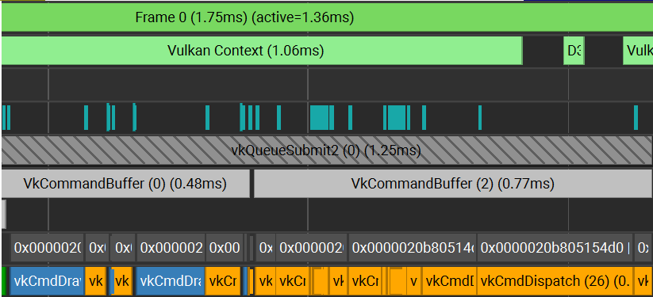

# 介绍

XRGUI(mo_yanXi's Retaine mode GUI)是一个近似**每帧重绘和局部更新**的带有**自动**布局的支持多个绘制后端（目前只实现了Vulkan)、力求轻量化的跨平台和支持所有主流编译器的纯粹面向命令式代码编写的**保留式GUI**

### 注：
* 在Windows上由于Clang在编译模块时会ice，暂且只允许msvc编译。本人并未尝试过使用MinGW的GCC编译，理论上库全部使用ISO C++的语法，GCC只要没有实现问题也可也直接编译
* 关于平台相关的极个别函数本人仅测试了Windows，尽管提供Linux上的平台相关函数抽象，但并未经过仔细测试。
总结：当前阶段建议仅使用最新的msvc工具链在Windows上编译和运行相关代码。

### 设计哲学：
*（截至目前）不适合用于生产*、特性使用激进（主要为语言特性，如C++23模块）

本库并非用于直接下游（即你的应用仅包括一套UI和和它直接相关的后端系统），相反，它被设计作为下游的一个组件。能表现出这一点的特征有：
1. 核心不提供窗口相关功能
2. 渲染只负责输出到输出附件（如Vulkan的Image）
3. GUI不需运行于主线程
4. GUI的默认绘制系统被设计为快优先，不默认提供元素级的clip或者蒙版操作（预计可能会支持，通过interlock color attachment之类，等到descriptor heap迁移后）。对于仅绘制到一个颜色附件上的流程来说，这套GUI只占据0.1ms（测试于NV RTX4080 Laptop，分辨率2K），对于样例来说，加上后处理和合成器部分，总计耗时约为1ms）

   (Nsight Profiler 对样例中拖动条页面的测试图，忽略被D3D打断的上下文约为1ms，其中后半部分的计算管线耗时全部为合成器产生)
5. 核心自己并不提供过多默认设置，用户负责初始化样例，着色器等。
6. 不提供声明式语法和反序列化式的UI构建，如有需要自行编写。待C++26反射可用后可能会内置。

一个设想的典型案例是你在某个线程启动UI，主线程输入外设事件，放行UI执行，在需要时等待UI完成绘制指令，然后递交绘制指令到GPU的任务队列，得到UI层的颜色附件。你提供任务交互，输入事件；拿到颜色附件和绘制命令，其它的事务则基本在GUI线程内自行消化。

* ***你永远不应该动态链接本库***

## [基础页面展示](properties/showcase/runtime_showcase.md)

## Brief

### 已实现布局
* 序列布局及其变种
* 表格布局
* 网格布局
* 缩放范围布局
* 二分布局及其变种

### 已实现元素
#### Core
* 通用按钮
* 离散数据选择按钮
* 翻板
* 进度条
* 拖动条
* 平面摄像机视口
* 滚动面板
* 菜单

#### Ext
* 复选框
* 图像框
* 文本元素
* 文本输入框

### 主体架构

#### Core
* **GUI Core** 即GUI的核心内容，包含异步控制、绘制接口、布局系统、简单的事件系统等核心内容。这部分内容原则上是后端API无关的

#### Extension/默认实现
* **Image Loader** 提供一个异步不阻塞的图像加载和管理系统，目前针对Vulkan，完全多线程可用。

* **Font/TypeSetting** 文本排版系统，仅提供LTR完全支持和有限的TTB支持，暂不支持RTL和BTT。内嵌一个简单的富文本系统，见[富文本操作文档](properties/showcase/rich_text_doc.md)

* **Assets Storage Manager** GUI的资源注册系统，目前暂不保证多线程访问安全，默认在加载时一次加载完毕

* **Compositor** GUI合成器，暂时并未对Buffer相关内容进行测试，提供一个基于内存别名复用的半自动化后处理管线合成处理器

* **Renderer Backend** 基于Vulkan-Mesh Shader-Dynamic Rendering-Descriptor Buffer(将在Descriptor Heap完全可用后迁移到Descriptor Heap)-Compute Graphics Mixed的渲染器，对CPU的压力较小，但是对驱动和硬件的要求较高

#### Backend/默认实现
* 提供一个基于GLFW-Vulkan的默认后端，以处理外设输入和交换链呈现

整个GUI系统理论上可以不必跑在主线程，只需要在特定同步点（如输入事件提交、拉取GUI输出命令、等待绘制命令录制、改变尺寸时）阻塞

由于GUI的定位是即时响应，并没有提供复杂的类似事件总线一样的设置。主要类似事件或事件的替代品如下：
* 外部输入事件使用简单的拦截方案进行传递，如果没有被UI元素拦截则回退给外部线程
* 重布局事件在元素内部进行传播和拦截，在更新时自动消费
* 独立更新由元素直接注册，在下一时刻启用/移除独立更新
* GUI和外界的信息交互使用任务队列
* GUI内部的异步任务会挂在特定元素上执行，主要用于异步创建巨大的元素子树
* 永远都是**即时重绘**，但是平铺的绘制命令会在绘制状态改变时重录
* UI元素的Action推送可以从任何线程发起以执行元素相关操作，但是执行都会在UI主线程进行

### 绘制流程

[绘图流程文档](properties/showcase/render_spec.md)

## Dependencies
* 带有'\*'标记的为Ext和默认后端所需的依赖。无论如何，在目前阶段我建议安装它们。

### Xmake Package Requirements
* [*freetype](https://freetype.org/) 
* [*harfbuzz](https://github.com/harfbuzz/harfbuzz)
* [*nanosvg](https://github.com/memononen/nanosvg)
* [*spirv-reflect](https://github.com/KhronosGroup/SPIRV-Reflect)
* [gtl](https://github.com/greg7mdp/gtl)
* [mimalloc](https://github.com/microsoft/mimalloc)
* [*GLFW](https://www.glfw.org/)
* [*simdutf(Optional)](https://github.com/simdutf/simdutf)
* [*msdfgen](https://github.com/Chlumsky/msdfgen)

### Submodules
* [plf_hive](https://github.com/mattreece/plf_hive) 
* [small_vector](https://github.com/gharveymn/small_vector) 
* [beman/inplace_vector](https://github.com/bemanproject/inplace_vector)
* [stb](https://github.com/nothings/stb)
* [*VMA (VulkanMemoryAllocator)](https://github.com/GPUOpen-LibrariesAndSDKs/VulkanMemoryAllocator)

### My own libs
* allocator2d
* mo_yanxi_react_flow
* mo_yanxi_vulkan_wrapper
* mo_yanxi_utility

### System
* *Vulkan SDK 1.4+
* *Slangc (用于编译默认着色器)
* *Node.js (用于转换默认icon到纯path表示)
* *Python (用于构建或者转换脚本)
* Xmake 

# TODO
* [ ] 文档
* [ ] 更多样例

### 数据流
* [ ] 优化基于大量虚函数的数据流
* [ ] 优化数据流写法，目前的太反人类
* [ ] 进行更多测试
* [ ] 为异步操作提供进度条
* [ ] 多线程调度？

### 提供包管理选项
* [ ] 可选择不同后端，默认Vulkan-GLFW
* [ ] 可选扩展，如文本渲染等（因为这部分产生大量包依赖）
* [ ] 关于模块如何写包我没找到一个好的best practice

### Core
* [ ] 音频支持，至少提供接口
* [ ] 减少虚函数调用量
* [ ] 更多测试
* [ ] 更多基础控件和布局
* [ ] 更多基于事件的操作
* [ ] 支持非硬编码的Key Mapping
* [ ] 视情况实现按需重绘和更新

### Extension
* [ ] 完善compositor

### Style
* [ ] 提供更多基本样式选择

### Render
* [ ] 完成所有基本的几何抗锯齿
* [ ] 完成所有可选贴图指令的UV排列

### Backend
#### Vulkan
* [ ] 对默认渲染器的完好封装，需要等到descriptor heap可用
