# 注：你可以自己重写style来提供比默认样式更好的效果

#### 注：当前展示页不包含所有元素，且也无法展示动画效果

---
### 启动页
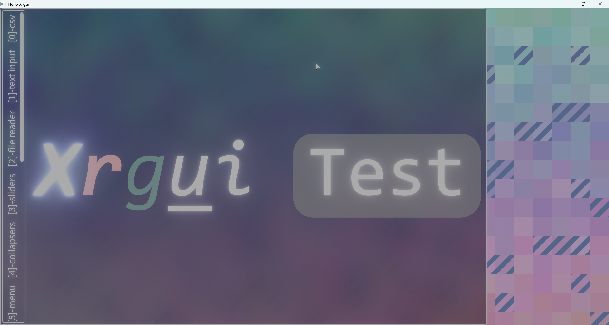

---
### 拖动条
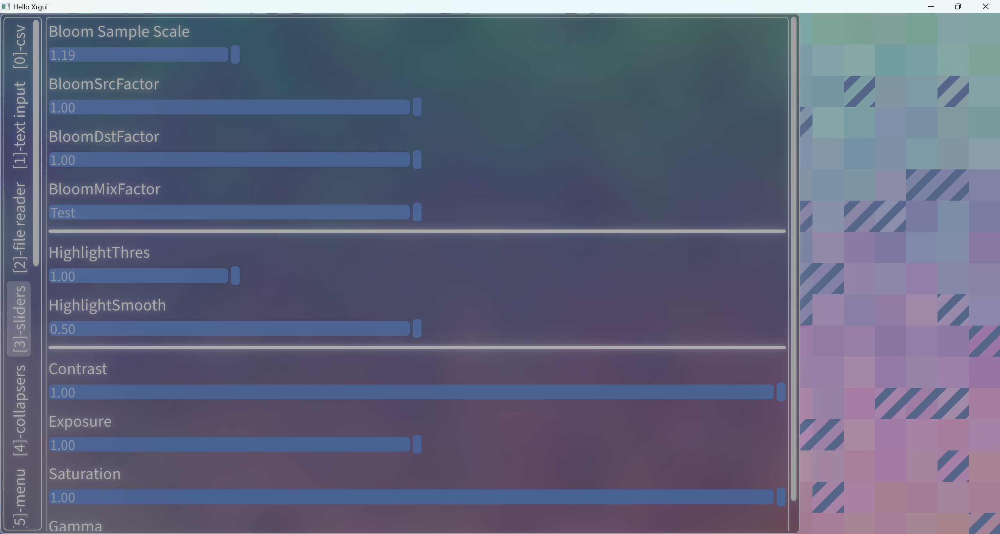

---
### 默认样式和Table布局
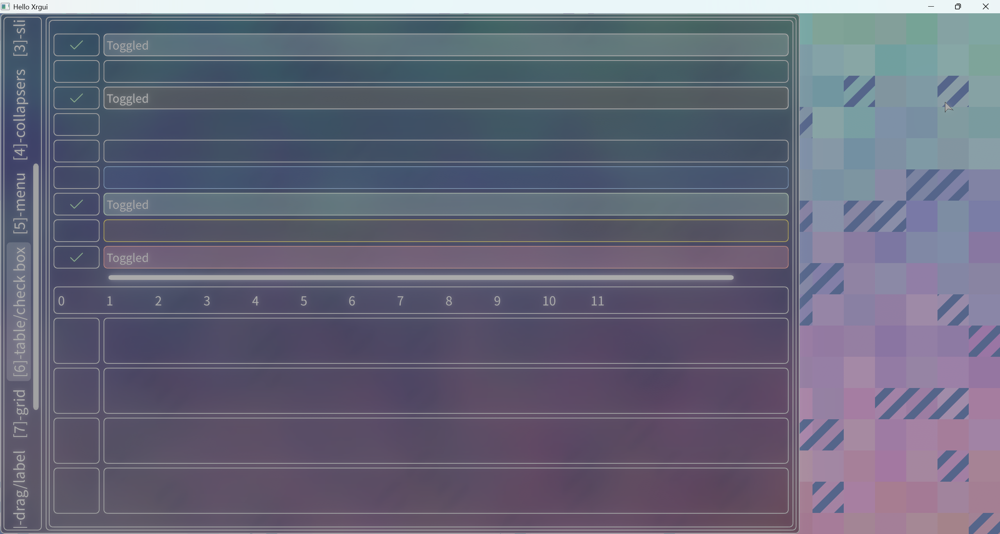

---
### 网格布局
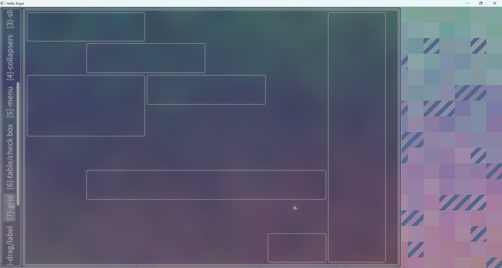

---
### 分隔框和简易富文本渲染
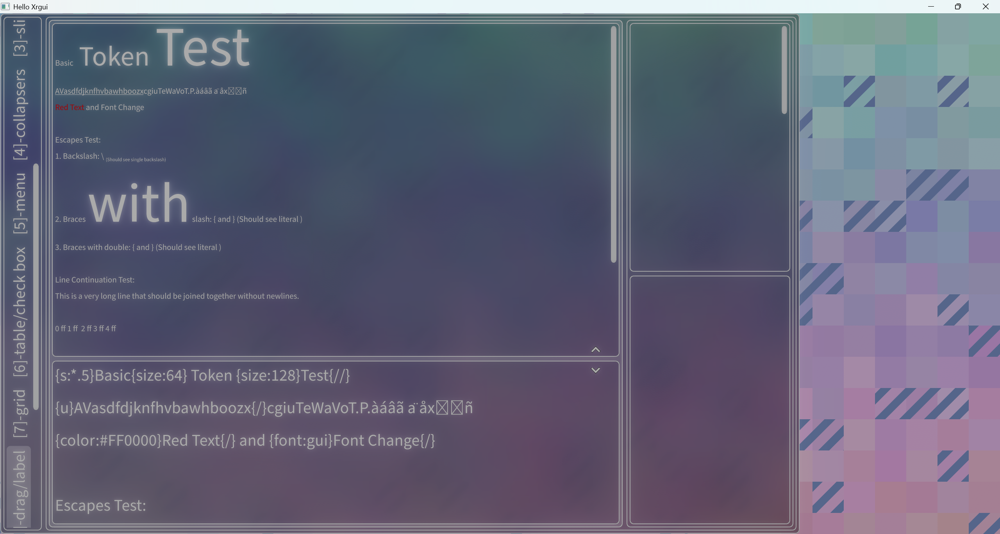

---
### 文件选择器
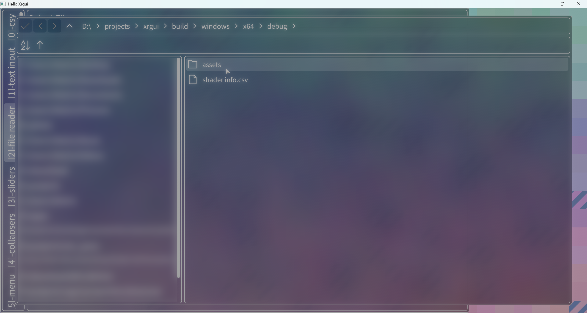

---
### Canvas-Viewport
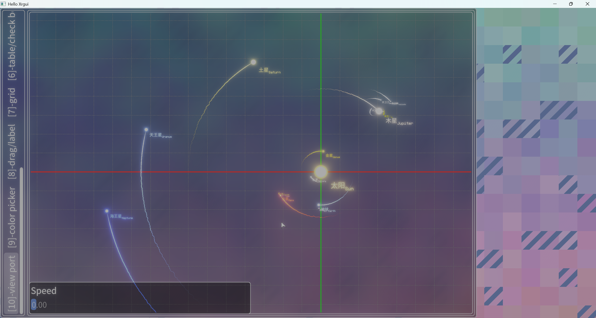

## 部分元素渲染
### CSV表格
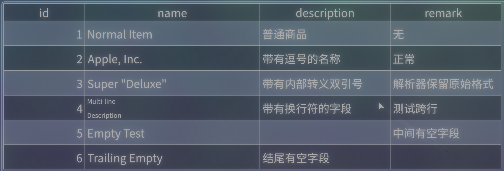

### 富文本渲染

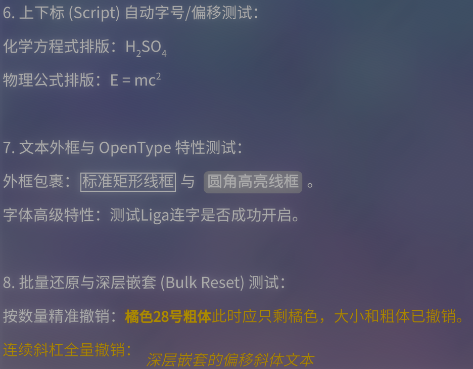

### Tooltip
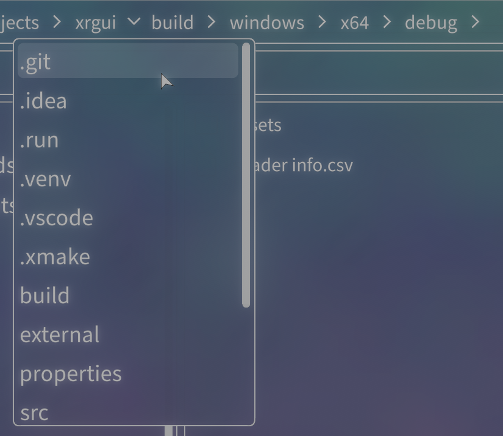

### 环形进度条
* 注：该元素是带有动画效果的

### 拾色器
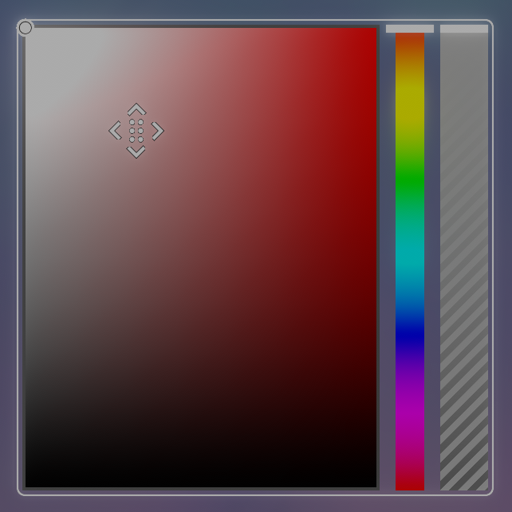

### 分割面板
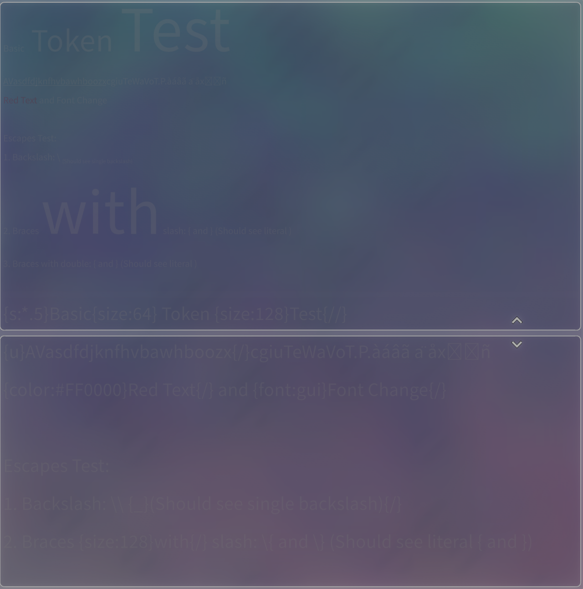

### 流溢序列
* 展开状态

* 压缩状态

